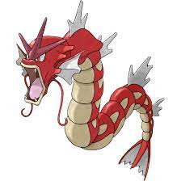

ECE 651: RISC --- *TEAM SHINY MAGIKARP*
=======================================

## Objective

Conquer the world and take over every territory on the map to win!

## Map

Initial territory allocation is automatically determined at the start of the game. The world consists of 24 territories, split equally among the players. Each player begins with 30 units to distribute throughout their territories.

<space><space><space><space>For 2 players: green, red

<space><space><space><space>For 3 players: green, red, blue

<space><space><space><space>For 4 players: green, red, blue, yellow

## Setup

&emsp1.  Determine the number of players (2-4)

&emsp2.  Open one terminal for the server and a terminal for each player (can be on separate computers)

&emsp3.  In the server terminal, enter: ./gradlew :server:run --args "4444 \[number of players]"

&emsp4.  In each player terminal, enter: ./gradlew : client:run --args "\[server name] 4444"

&emsp5.  Follow in-game instructions to play game

## Coverage

[Detailed coverage](https://jwp42.pages.oit.duke.edu/risc_group14/dashboard.html)

## Maya's Zoom room

[Zoom](https://duke.zoom.us/j/2890260385)

## Project task breakdown Google Sheet

[Task breakdown](https://docs.google.com/spreadsheets/d/1xeX1LhQHKaW_9kBSZ3u_cWfS7HyXmD4L6DTs8RlQopE/edit?usp=sharing)

## UML diagrams

[Original design](https://app.diagrams.net/#G1HFjMe-Hy9eAgr037qpsjU75oSxQrfZVQ)

[Current design (updated regularly)](https://app.diagrams.net/?src=about#G1Ilg7adHG6R4JDfX9gzBJC00pYGc0vjiD)

